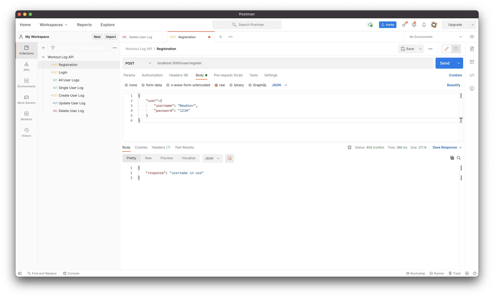
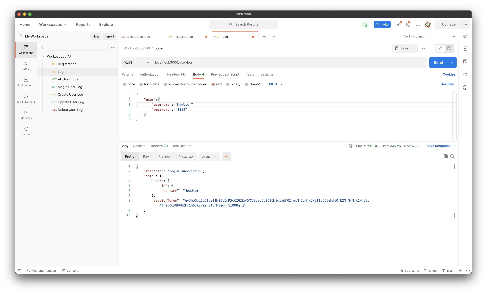
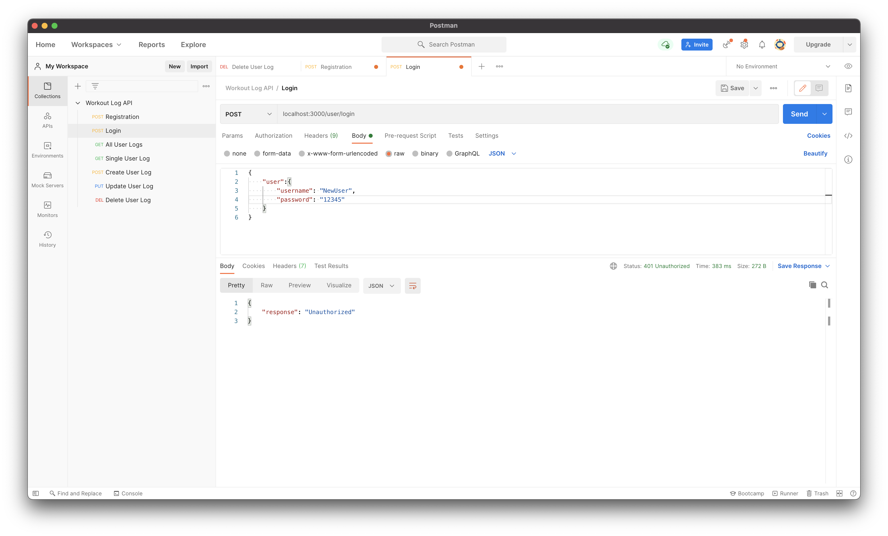
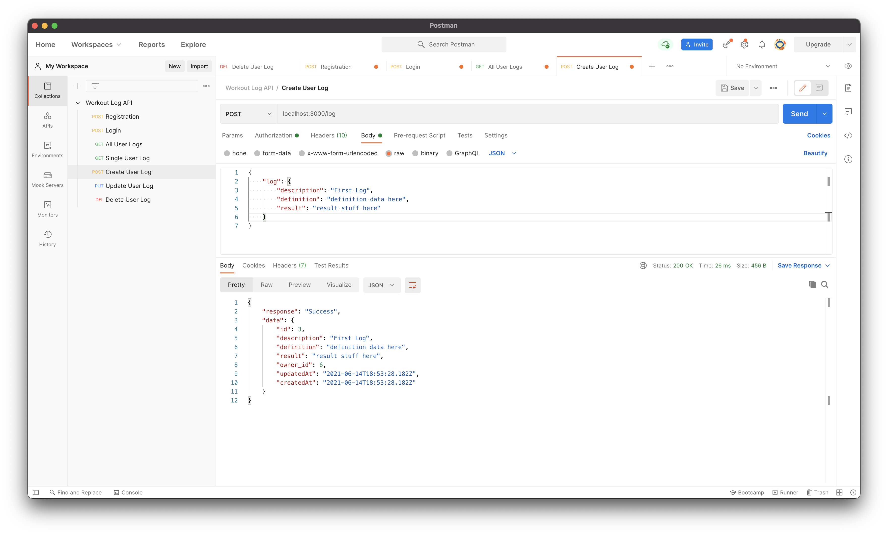
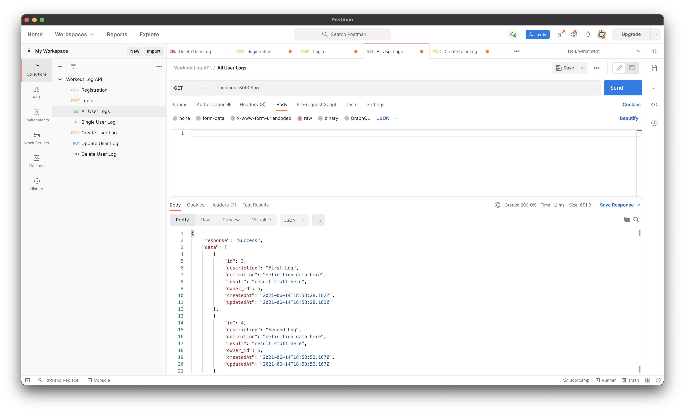
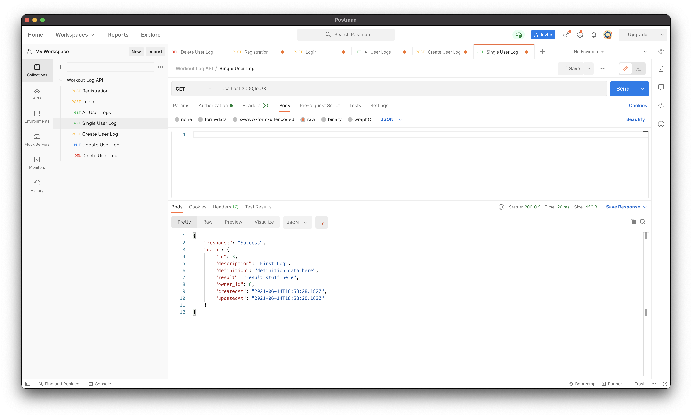
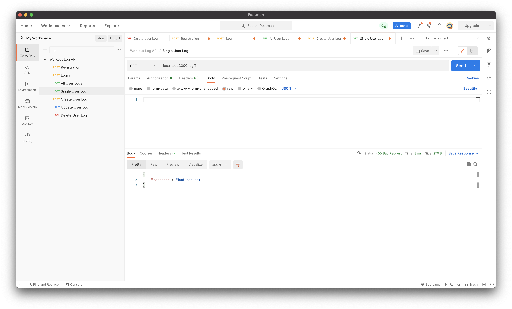
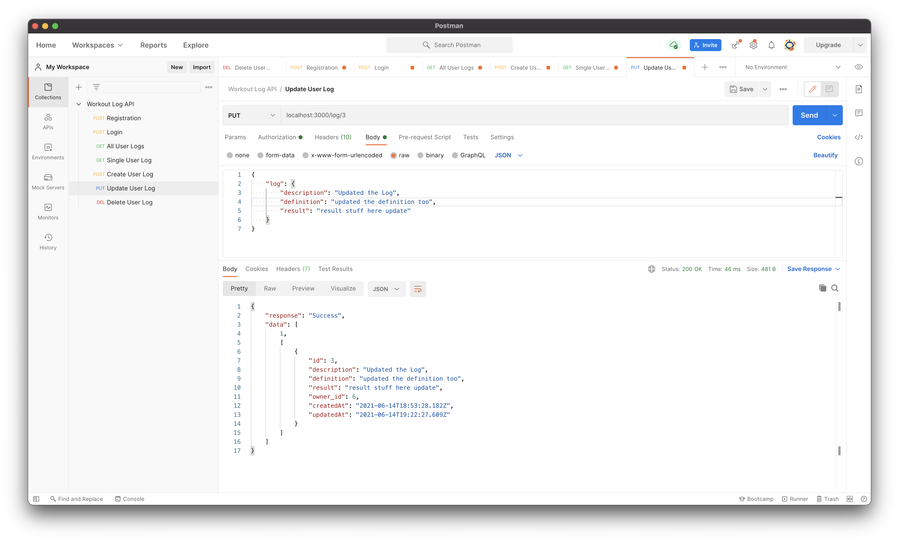
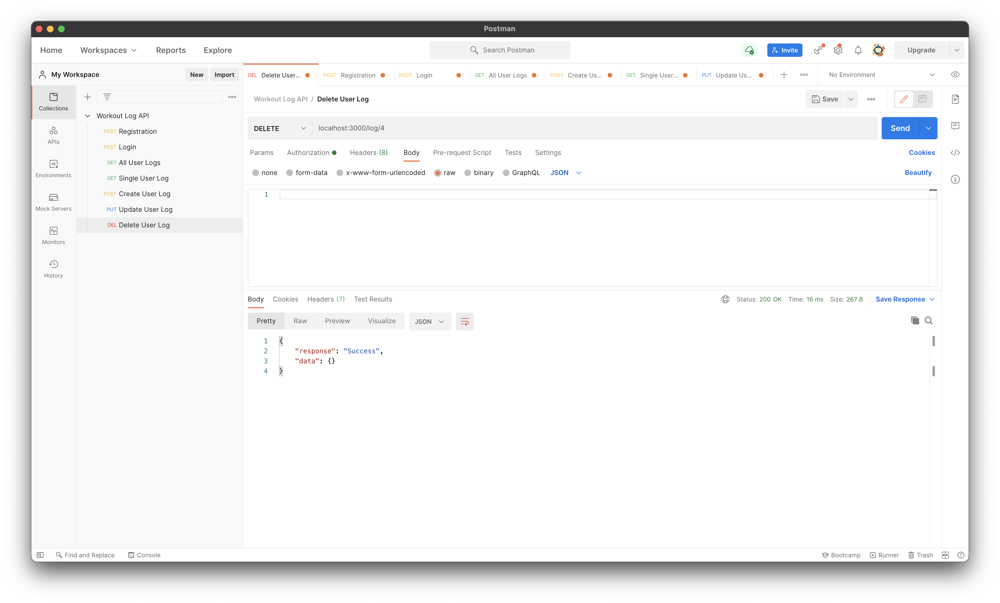

## WOL Test Information

### JSON Structure

Register / Login:

```json
{
  "user":{
    "username": "User",
    "password": "1234"
  }
}
```

Create / Update Log:

(requires session token, provided by /login)

```json
{
  "log": {
    "description": "First Log",
    "definition": "definition data here",
    "result": "result data here"
  }
}
```


## Screenshots
> Registration Success


> Registration Duplicate


> Login Success


> Login Failure


> Create Log Entry


> Get All Logs


> Get Single Log


> Get Log Failure


> Update Log Entry


> Delete Log Entry

